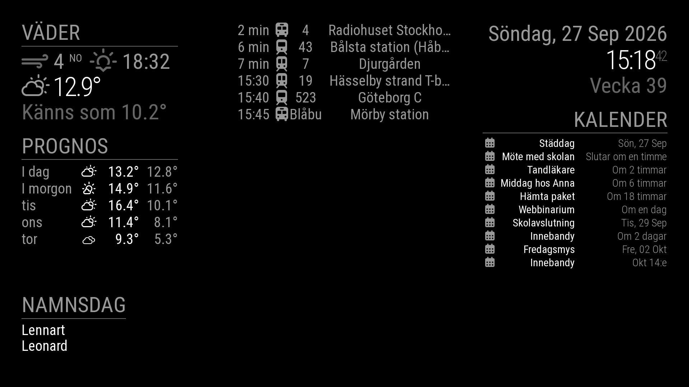

# MirrorBerry

A lightweight smart-mirror display for the **Raspberry Pi Zero W**, inspired by
and designed to look like [MagicMirror²](https://magicmirror.builders/).

MagicMirror² runs in a web browser (Electron), which needs more memory and CPU
than a Pi Zero W has. MirrorBerry draws the same kind of screen with Python and
pygame, straight to the Linux framebuffer (`/dev/fb0`): no desktop, X server,
browser or GPU driver, so it runs on the Zero's single 1 GHz core and 512 MB.



*Weather and forecast (SMHI), departures (Trafiklab), clock, calendar and
Swedish name days. The layout is calibrated to match a MagicMirror² screen.*

## Features

- **Clock** with date, superscript seconds and ISO week number.
- **Weather**: current conditions and a daily forecast from
  [SMHI](https://www.smhi.se/) (Sweden and the Nordic area) or
  [Open-Meteo](https://open-meteo.com/) (worldwide), processed exactly like
  MagicMirror²'s weather module. No API key needed.
- **Calendar** from any iCal (.ics) feed: Google, iCloud, Outlook, Nextcloud.
  Recurring events, MagicMirror²'s relative wording ("I morgon", "Om 2 timmar")
  or absolute dates, Font Awesome symbols per calendar.
- **Public transport departures** in Sweden from
  [Trafiklab](https://www.trafiklab.se/) (ResRobot or the Realtime API), like
  MMM-ResRobot, with real-time times where available.
- **Swedish name days** (namnsdagar), like MMM-Namnsdag.
- **MagicMirror² look**: Roboto Condensed, its size classes, headers, colours
  and fading lists, plus a `[theme]` section that works like a `custom.css`.
- **3x3 zone layout** where widgets stack like modules in MagicMirror² regions.
- Swedish and English texts, following the system locale.
- Robust on a small Pi: downloads run in the background, data is cached when the
  network drops, only changed parts of the screen are redrawn, and a widget with
  a bad setting shows the problem in its own zone instead of stopping the app.

## Quick start

On a Raspberry Pi running **Raspberry Pi OS Lite** (full steps in
[docs/installation.md](docs/installation.md)):

```bash
sudo apt install -y python3-pygame fonts-roboto-unhinted python3-recurring-ical-events git
git clone https://github.com/Xigg0ns/mirrorberry.git ~/mirrorberry
cd ~/mirrorberry
cp config.example.toml config.toml   # then edit config.toml
python3 -m mirrorberry               # Esc or q to quit
```

Start at boot with the included systemd service:

```bash
sudo cp deploy/mirrorberry@.service /etc/systemd/system/
sudo systemctl daemon-reload
sudo systemctl enable --now mirrorberry@$USER
```

Try it on a PC first (Python 3.11 or newer):

```bash
pip install pygame recurring-ical-events
python3 -m mirrorberry --size 1280x720             # in a window
python3 -m mirrorberry --screenshot preview.png    # render one frame, no screen needed
```

The MagicMirror² look needs the Roboto fonts at the Debian/Ubuntu location
(`sudo apt install fonts-roboto-unhinted`); elsewhere MirrorBerry falls back to
pygame's default font.

## Documentation

| Document | Contents |
|----------|----------|
| [Installation](docs/installation.md) | Preparing the Pi, installing, running at boot, updating, troubleshooting |
| [Configuration](docs/configuration.md) | Every setting in `config.toml`: display, layout, theme, zones and all widget options |
| [Coming from MagicMirror²](docs/magicmirror.md) | How MagicMirror² concepts and module options map to MirrorBerry |
| [Development](docs/development.md) | How it works, writing your own widget, project structure |

## Built with AI

MirrorBerry was developed with the help of AI. The code, the calibration against
MagicMirror² and this documentation were written in conversation with Claude, an
AI assistant made by Anthropic, directed and tested by the author on a real
Raspberry Pi Zero W.

Where MirrorBerry recreates MagicMirror² behaviour, it was checked against the
original: the SMHI weather processing was run side by side with MagicMirror²'s
own `smhi.js` and matches it in all 235 test checks, and the layout was measured
element by element against a screenshot of a real MagicMirror² screen. Bug
reports and pull requests are welcome.

## Credits

MirrorBerry is an independent project. It is not affiliated with or endorsed by
MagicMirror², the authors of the modules below, or the data providers.

- **[MagicMirror²](https://github.com/MagicMirrorOrg/MagicMirror)** by Michael
  Teeuw and contributors (MIT). The look, the size classes, the clock, weather
  and calendar behaviour, and the Swedish and English texts follow MagicMirror².
  The weather processing (including the SMHI provider) and the calendar wording
  are ported from its default modules.
- **[MMM-ResRobot](https://github.com/Alvinger/MMM-ResRobot)** by Johan Alvinger
  (MIT). The departures widget is a port of this module.
- **[MMM-Namnsdag](https://github.com/Menturan/MMM-Namnsdag)** by Menturan
  (GPL-3.0). The name-day widget recreates this module's behaviour and uses the
  same data source.
- **[suncalc](https://github.com/mourner/suncalc)** by Volodymyr Agafonkin
  (BSD-2-Clause), ported for sunrise and sunset times.
- **[moment.js](https://momentjs.com/)** (MIT): relative time wording rules.
- **[Font Awesome Free](https://fontawesome.com/)** (icons CC BY 4.0, font SIL
  OFL 1.1) and **[Weather Icons](https://erikflowers.github.io/weather-icons/)**
  by Erik Flowers (SIL OFL 1.1) are bundled in `mirrorberry/assets/fonts/`.
- **Roboto** and **Roboto Condensed** by Google (Apache 2.0), installed from the
  distribution's `fonts-roboto-unhinted` package.

Data comes from [SMHI](https://www.smhi.se/data) (CC BY 4.0 SE),
[Open-Meteo](https://open-meteo.com/) (CC BY 4.0, free for non-commercial use),
[Trafiklab](https://www.trafiklab.se/) (Realtime API: CC BY 4.0; ResRobot: CC0)
and the Svenska Dagar API ([sholiday.faboul.se](https://sholiday.faboul.se/)).
Please follow each service's terms; see [THIRD_PARTY_NOTICES.md](THIRD_PARTY_NOTICES.md)
for all licences and attribution requirements.

## License

Copyright (C) 2026 Xigg0ns

MirrorBerry is free software: you can redistribute it and/or modify it under the
terms of the [GNU General Public License](LICENSE) as published by the Free
Software Foundation, either version 3 of the License, or (at your option) any
later version. It is distributed in the hope that it will be useful, but WITHOUT
ANY WARRANTY; see the licence for details.

Parts ported from MIT- and BSD-licensed projects keep their original notices,
and the bundled fonts keep their own licences; see
[THIRD_PARTY_NOTICES.md](THIRD_PARTY_NOTICES.md).
